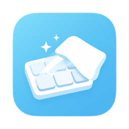
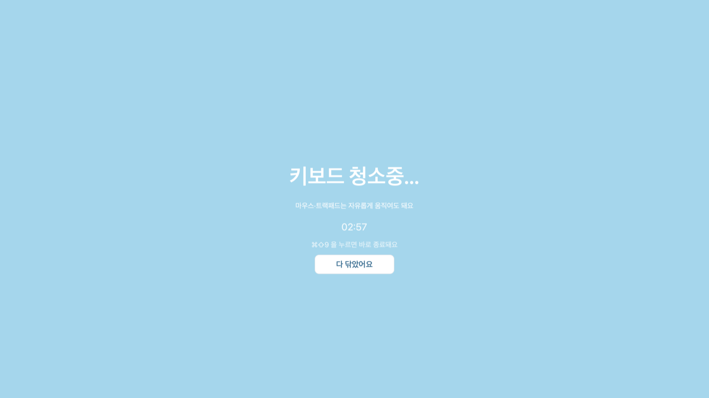

<p align="center">
  
</p>

<a id="korean"></a>

# 닦아 (ddak-a)

**한국어** · [English](#english)

> **기준일:** 2026-09-23
> **상태:** **v1.2 공개 배포 중** — [Releases](https://github.com/Hyunjin-Cho/ddak-a/releases)에서 받을 수 있다 (앱·DMG 모두 Apple 공증 완료)

<!-- 🔒 2026-09-22 (PR #1 리뷰 F-3): 이 상태 줄과 아래 "v1.1부터는 …" 문장은 반드시 같이 움직인다.
     이 문서가 새 버전 동작을 현재형으로 안내하는데 Releases 에 그 버전이 없으면, 받아서 써 본
     사람에게는 "설명대로 안 된다"가 된다. 다음 버전을 준비할 때도 같은 순서로 — 릴리스 전까지는
     상태 줄에 "· vX.Y 준비 중"을 붙여 두고, 올리는 날 떼고 올린다. -->

맥 키보드를 닦을 때 실수로 키가 눌려도 입력이 컴퓨터에 전달되지 않도록, 앱이 켜져 있는 동안
**키보드를 통째로 차단**하는 macOS 유틸리티. **마우스와 트랙패드는 그대로 살아있다.**

<p align="center">
  <b>macOS 12 (Monterey) 이상</b> · <b>Intel · Apple Silicon 모두 지원</b>
</p>

<p align="center">
  
  <br>
  <sub>실행 중 화면 — 연결된 <b>모든 모니터</b>를 이렇게 덮는다 (사진은 화면 가운데 부분)</sub>
</p>

## 설치

1. [Releases](https://github.com/Hyunjin-Cho/ddak-a/releases)에서 `.dmg`를 받는다
2. 열리는 창에서 **`닦아`를 `Applications` 폴더로 드래그**한다
3. 응용 프로그램 폴더에서 실행한다

> ### ⚠️ 반드시 응용 프로그램 폴더로 옮긴 뒤 실행할 것
>
> macOS는 인터넷에서 받은 앱을 응용 프로그램 폴더 **밖**에서 실행하면, 매번 임시로 만든
> 다른 경로에 복사해서 실행한다(App Translocation). **이 임시 경로에서 실행되면
> 손쉬운 사용·입력 모니터링 권한이 붙지 않는다** — 권한을 켜도 다음 실행 때 다시 꺼져 있다.
>
> 응용 프로그램 폴더로 **직접 옮기면** 이 동작이 풀린다. 앱을 다운로드 폴더나 바탕화면에
> 꺼내 둔 채로 쓰면 권한이 영영 붙지 않는다.
>
> v1.1부터는 앱이 이 상태를 스스로 알아채고, **권한을 묻기 전에** 안내하고 종료한다.

<!-- 🚨 2026-09-22 정정: 위 문단에 원래 "손쉬운 사용·입력 모니터링 권한은 앱의 경로를 함께
     기억하기 때문에"라고 적혀 있었다. 그건 기전 단정이고 1차 근거가 없다 — macOS 권한 DB가
     무엇으로 앱을 식별하는지는 확인하지 못했다. 관측된 사실("임시 경로에서 실행되면 권한이
     붙지 않는다")까지만 남긴다. 같은 문장이 release.sh 주석에도 있었고 함께 고쳤다. -->

<!-- 🧪 2026-09-22 실측 (macOS 27.0, 공증·티켓 부착된 v1.1 빌드로 오너가 직접 확인).
     위 문단을 쓸 때 몰랐던 것 세 가지가 이날 갈렸다. 다시 파기 전에 여기부터 읽을 것.

     ① App Translocation 이 걸리는 조건이 갈렸다
        · 내려받은 DMG 를 열어 그 안에서 바로 실행  → 걸리지 않는다 (2회 확인. Gatekeeper
          승인 전후 모두, 앱이 /Volumes/... 에서 그대로 돌았고 AppTranslocation 디렉터리가
          만들어지지도 않았다)
        · 앱을 다운로드 폴더에 꺼내 두고 실행        → 걸린다
          (/private/var/folders/.../AppTranslocation/<UUID>/d/ 에서 돌았다)
        → 그래서 이 안내는 "DMG 에서 바로 실행하지 마라"보다 **"응용 프로그램 폴더가 아닌
          곳에 꺼내 두고 쓰지 마라"** 가 정확하다. 위 문단을 그렇게 고쳤다.

     ② 권한은 경로로 따라가지 않는다 — 번들 ID 와 서명이다
        /Applications 의 사본과 저장소 빌드본은 경로가 다른데도 권한을 다시 묻지 않았다.
        두 앱의 지정 요구(designated requirement)가 동일하고 거기에 경로가 한 글자도 없다:
          identifier "com.vismotive.ddaka" and anchor apple generic and ... leaf[subject.OU] = "6RH6FXY82P"
        → v1.0 사용자가 v1.1 로 올려도 권한이 유지된다. (TCC 내부가 정확히 이 요구를 쓰는지까지는
          확인하지 못했다. 확인된 것은 "경로가 기준이 아니다"까지다.)

     ③ 안내창을 띄워 둔 채 앱을 옮겨 실행하면 아무 반응이 없다
        LSMultipleInstancesProhibited 때문에 두 번째 실행이 막히고, 임시 경로에서 돌던
        인스턴스가 앞으로 나온다. 화면에 이미 그 창이 떠 있으므로 사용자 눈에는 "아무 일도
        일어나지 않는다"로 보인다. 그래서 안내 문구에 "확인 -> 종료 -> 옮기기" 순서를 넣었다
        (main.swift 의 translocatedBody). 문구는 함정을 줄이는 것이지 없애지는 못한다 —
        없애려면 안내 중 백그라운드 전환 시 자동 종료 같은 동작 변경이 필요하고, 그건 넣지 않았다. -->

첫 실행 때 **손쉬운 사용**과 **입력 모니터링** 권한을 요청한다. 둘 다 있어야 키보드를 막을 수 있다.

## 동작 방식

1. 앱 실행 → "닦아 실행할까요?" 확인
2. 권한 확인 — **손쉬운 사용** + **입력 모니터링** 두 가지가 필요 (없으면 앱이 직접 요청한다)
3. 연결된 **모든 모니터**를 하늘색 전체화면으로 덮고 카운트다운 시작
4. 종료 조건 (셋 중 먼저 오는 것)
   - "다 닦았어요" 버튼 클릭 → 즉시 종료
   - 3분 카운트다운 종료 → 자동 종료
   - **Cmd + Shift + 9 (⌘⇧9)** → 앱이 직접 감지해 즉시 종료

## 단축키 하나로 켜고 끄기 (선택)

<!-- 🚨 2026-09-23 신설 — 홍보글 댓글 제안("아이콘 클릭 없이 단축키로 실행 · 같은 키를 한 번 더 누르면 해제")을
     앱을 고치지 않고 macOS 단축어 앱으로 푼다. 닦아는 청소가 끝나면 스스로 종료하는 앱이라 꺼져 있을 때는
     단축키를 받을 수 없다. 앱이 직접 받으려면 메뉴 막대 상주형으로 바꿔야 하고(종료 경로 · 195초 강제 종료를
     다시 짜야 한다) 그건 v1.2 범위 밖이다.
     실측(2026-09-23 · macOS 27.0 · 단축어 10.0 · 닦아 v1.1 — ⌘⇧9 처리는 v1.2 와 같다): 오너가 ⌘⇧9 로 켜고
     청소 중 ⌘⇧9 로 껐고, 실행 기록상 청소까지 들어간 세션 3번 모두 끝나는 순간의 단축어 실행
     (BackgroundShortcutRunner)이 0건이었다. 청소 밖에서는 ⌘⇧9 마다 단축어가 돌았다 — 즉 청소 중에는 닦아의
     키 차단이 ⌘⇧9 를 먼저 삼켜 단축어에 닿지 않는다. 타이밍이 아니라 순서의 문제라 "다시 켜짐" 경쟁이 없다.
     🔒 메뉴 이름은 같은 맥의 단축어 문구 파일(WorkflowUI · WorkflowKit 의 Localizable.loctable)에서 확인한 값이다.
     단축어 앱이 바뀌면 이름도 바뀔 수 있으니 이 절을 고칠 때 다시 확인한다. -->

macOS에 기본으로 들어 있는 **단축어** 앱에 키보드 단축키를 걸면, 아이콘을 누르지 않고 닦아를 켤 수 있다.
그 키를 **⌘⇧9** 로 걸면 켜는 키와 끄는 키가 같아진다 — **⌘⇧9 하나만 기억하면 된다.**

1. **단축어** 앱에서 **＋** 를 눌러 새 단축어를 만든다
2. **앱 열기** 동작을 넣고, 앱으로 **닦아**를 고른다
3. **단축어 세부사항**(ⓘ) → **키보드 단축키 추가** → **⌘⇧9** 를 누른다

이제 **⌘⇧9** → 확인창에서 **예** → 청소 시작, 청소 중 **⌘⇧9** → 종료.

- 청소 중에 누른 ⌘⇧9 는 닦아가 먼저 받는다. 단축어가 닦아를 다시 켜는 일은 없다
  (macOS 27.0 · 단축어 10.0 에서 실행 기록으로 확인. 단축어 앱은 macOS 12부터 있지만 그 아래 버전은 확인하지 못했다)
- 다른 키를 걸어도 켜는 건 되지만, **끄는 키는 언제나 ⌘⇧9** 다

## 차단 범위

<!-- 🧪 2026-09-23 실기로 두 줄 추가 (리뷰 N-1 · N-3) — 오너 · macOS 27.0 · Mac Studio + Magic Keyboard with Touch ID · v1.2.
     통합 로그로 확정한 것:
     - Touch ID 키는 키보드 이벤트가 아니라 biometrickitd(`touchIDButtonPressed`)가 받는다 → 이벤트 탭 밖이고, macOS 의 정상 동작이다.
       한 번 → loginwindow `lockScreenImmediateFromTouchIDPress`(잠금). 0.6초 안에 세 번 → UniversalAccessControl(「손쉬운 사용 단축키」 창 + 음성).
       잠긴 동안에도 닦아는 계속 돌았고, 잠금을 푼 뒤 버튼으로 정상 종료했다(`tapReenabled=0`).
     - 🌐(fn)은 flagsChanged 로 들어와 탭이 통과시킨다(⌘⇧9 판정을 위해 조합키를 통과시키는 설계 — main.swift `.flagsChanged` 분기).
       🌐 를 받아쓰기로 쓰는 맥에서 "Dictation Hotkey start triggered" 바로 다음에 "Dictation did not start because there is
       bottom line input" — 받아쓰기는 시작 단계에서 끝났다. 🌐 를 입력 소스 전환·이모지로 쓰는 맥은 아직 확인하지 않았다. -->

| 대상 | 차단 여부 |
|---|---|
| 내장 키보드 | 차단 |
| 블루투스·USB 외장 키보드 | 차단 |
| 밝기·볼륨 등 미디어 키 | 차단 |
| Touch ID 키 | **통과 — macOS 가 처리하는 정상 동작.** 한 번 누르면 화면이 잠기고, 빠르게 세 번 누르면 「손쉬운 사용 단축키」 창이 뜬다. 잠금을 풀면 청소 화면이 그대로 이어진다 |
| 🌐(fn) 키 | **통과** — 청소 화면에는 입력 칸이 없어서 그대로 지나간다 |
| Cmd + Shift + 9 (⌘⇧9) | 앱이 감지해 **즉시 종료** (다른 앱에는 전달하지 않음) |
| 마우스 · 트랙패드 | 차단하지 않음 |

## 안전장치

키보드를 막는 앱이라 "풀리지 않는 상태"가 가장 위험하다. 그래서 서로 독립적인 장치를 겹쳐 두었다.

- 3분 카운트다운이 끝나면 정상 종료한다
- 카운트다운과 **별개로 도는** 안전 타이머가 190초에 한 번 더 종료를 시도한다
- 위 타이머마저 실패할 경우를 대비해, **앱의 메인 로직과 무관한 백그라운드**에서 195초를 잰 뒤
  프로세스를 강제 종료한다. 프로세스가 사라지면 키보드 차단도 함께 사라진다
- 탈출 버튼을 **모든 모니터에** 띄운다 (마우스가 어느 화면에 있든 누를 수 있도록)
- 화면이 작아도 탈출 버튼이 잘리지 않도록 배치를 비례 축소한다 (모니터를 여럿 쓰면서 작은
  보조 화면이 섞이는 구성 대비)
- **두 번 실행되지 않도록 막아 둔다.** 차단하는 앱이 둘이면 탈출 단축키를 눌러도 하나만 꺼지고
  나머지가 계속 막기 때문이다. macOS 27에서 동작을 확인했고 그 아래 버전은 확인하지 못했다 —
  설령 막히지 않더라도 위의 자동 해제 장치들이 각 인스턴스마다 그대로 돌아간다

## 문제가 생겼을 때 (로그)

<!-- 2026-09-23 (#10) 신설. 종료 이유 값은 main.swift 의 FinishReason 과 짝이다 — 한쪽만 바꾸지 말 것. -->

v1.2부터 닦아는 청소가 **어떻게 끝났는지**를 macOS 로그에 남긴다. 키보드가 늦게 풀렸거나
이상하게 끝났다면, 터미널에서 아래를 실행해 결과를 [이슈](https://github.com/Hyunjin-Cho/ddak-a/issues)에
붙여 주면 원인을 빨리 찾을 수 있다.

```bash
/usr/bin/log show --last 1h --predicate 'subsystem == "com.vismotive.ddaka"'
```

- `reason=` 뒤가 종료 이유다 — `done-button`(버튼) · `countdown`(3분) · `shortcut`(⌘⇧9) ·
  `safety-timer`(190초 안전 타이머) · `screens-gone`(화면이 모두 사라짐)
- 195초 강제 종료가 동작했다면 `hard kill` 이 남는다
- 🔒 **키 입력 내용은 기록하지 않는다.** 남는 것은 시작·종료, 종료 이유, 권한 상태 같은 앱의 동작뿐이다

## 빌드

```bash
bash build.sh
```

Intel + Apple Silicon 유니버설 바이너리로 빌드하고, `.app` 번들로 묶은 뒤 코드 서명까지 한다.
서명에 쓸 인증서는 환경변수로 바꿀 수 있다.

```bash
DDAKA_SIGN_IDENTITY="Developer ID Application: ..." bash build.sh
```

> 인증서 없이 ad-hoc으로 서명하면 **빌드할 때마다 앱의 신원이 바뀌어** macOS가 다른 앱으로 인식하고,
> 손쉬운 사용·입력 모니터링 권한이 매번 풀린다. 정식 인증서로 서명해야 권한이 유지된다.

## 외부 배포 (Apple 공증)

> **이 절은 저장소를 직접 빌드해 배포하려는 경우를 위한 것이다.** 앱을 쓰기만 할 거면 위 「설치」만
> 보면 된다. 여기 적힌 절차는 **각자의 Developer ID 인증서와 Apple 계정으로** 진행하는 것이며,
> 이 저장소에는 인증서나 비밀번호가 들어 있지 않다(둘 다 각자의 macOS 키체인에만 있다).

다른 사람에게 배포하려면 Developer ID 서명뿐 아니라 Apple 공증과 티켓 부착까지 끝내야 한다.
비밀번호는 저장소나 스크립트에 넣지 않고 macOS 키체인에 보관한다.

### 1. 최초 한 번 — 공증 인증 정보를 키체인에 저장

[Apple 계정 페이지](https://account.apple.com/)의 **로그인 및 보안 > 앱 전용 암호**에서 공증용 암호를 하나 만든다.
아래 명령은 그 앱 전용 암호를 화면에 표시하지 않고 안전하게 물어본 뒤 `ddaka-notary`라는 이름으로 저장한다.

```bash
xcrun notarytool store-credentials "ddaka-notary" \
  --apple-id "본인의 Apple ID" \
  --team-id "6RH6FXY82P"
```

### 2. 설치 창을 만드는 도구 준비 (최초 한 번)

DMG 를 열었을 때 나오는 설치 창(배경 그림·아이콘 위치·창 크기)은 `dmgbuild` 로 만든다.
시스템 파이썬을 건드리지 않도록 프로젝트 전용 가상환경에 설치한다.

```bash
python3 -m venv .tools/venv
.tools/venv/bin/python -m pip install dmgbuild
```

> 🔒 **`dmgbuild` 는 1.6.7 이상이어야 한다.** macOS 26.2 에서 `.DS_Store` 에 `pBBk` 블롭이
> 들어 있으면 DMG 배경이 표시되지 않는 회귀가 있었는데(FB21405103), `dmgbuild` 1.6.7 이
> 그 블롭을 빼면서 해결됐다. 낮은 버전으로 만들면 **배경 없는 맨 창이 조용히 나간다** —
> 빌드는 성공하므로 눈으로 보기 전에는 모른다. `release.sh` 가 시작 전에 버전을 확인한다.

> macOS 는 원래 이 설정을 Finder 에게 시켜서 만들지만, **macOS 27 에서는 Finder 의
> "배경 그림 지정"이 동작하지 않는다** — 설정하면 오류 없이 무시되고, 읽으면 `-10000`
> 오류가 난다(2026-09-22 실측). `dmgbuild` 는 Finder 를 거치지 않고 `.DS_Store` 를 직접
> 만들기 때문에 이 문제의 영향을 받지 않는다.
>
> 창 구성은 `assets/dmg-settings.py` 에 있다. 아이콘 좌표는 배경 그림
> (`assets/dmg-background.swift`)의 화살표 위치와 같아야 한다 — 한쪽만 고치면 어긋난다.

### 3. 외부 배포본 만들기

```bash
bash release.sh
```

`release.sh`는 아래 단계를 모두 통과해야 `dist/` 안에 최종 `.dmg`를 만든다.

<!-- 2026-09-23 (#6·#7): 1번(작업 폴더 확인)·2번(공개된 버전 확인)·4번(이전 결과 옮겨 두기)·
     7번(소스 기록)을 더했다. -->

1. 작업 폴더가 깨끗한지 확인 — 커밋하지 않은 변경이나 추적하지 않는 새 파일이 있으면 멈춘다
   (빌드 번호가 커밋 수라서, 섞인 채로 만들면 다른 소스가 같은 번호로 나간다)
2. 이미 공개된 버전인지 확인 — 로컬이나 `origin` 에 `v<버전>` 태그가 있으면 멈춘다. 원격을 확인하지
   못해도(네트워크·인증) 멈춘다 — 확인하지 못한 것을 "없다"로 치지 않는다
3. 키체인 프로필·인증서·도구(`dmgbuild` 버전 포함)가 준비됐는지 확인 (여기까지 모두 긴 빌드 전에 걸러낸다)
4. 같은 버전으로 먼저 만든 결과가 있으면 지우지 않고 `release-records/<버전>.prev-<시각>/` 으로 옮긴다
5. Intel + Apple Silicon 유니버설 빌드
6. Developer ID 서명과 Hardened Runtime 적용
7. 어떤 소스로 빌드했는지 `release-records/<버전>/source.txt` 에 기록 — 빌드 도중 커밋·파일이 바뀌지
   않았는지, 빌드 번호가 커밋 수와 같은지 대조한 뒤에 남긴다
8. 서명이 **제대로** 됐는지 단언 — Hardened Runtime · 신뢰 타임스탬프 · `get-task-allow` 없음
9. 디버그 심볼(dSYM)을 배포 바이너리와 UUID 대조 후 `release-records/` 에 보관
10. **앱** 공증 제출 → 승인 대기 → 티켓 부착 (제출 ID·로그도 함께 보관)
11. 응용 프로그램 폴더 바로가기를 넣은 **DMG** 생성
12. **DMG** 서명 → 공증 → 티켓 부착
13. Gatekeeper 실행 가능 여부 최종 확인
14. 배포물 SHA-256 을 `dist/*.dmg.sha256` 에 기록

> 급할 때는 `DDAKA_ALLOW_DIRTY=1 bash release.sh` 로 1번을 넘길 수 있다. 크게 경고하고, `source.txt` 에
> dirty 표시와 변경 목록·diff 해시를 남긴다 — 그 커밋만으로는 재현되지 않는 빌드라는 표시다.
> 2번(태그 확인)에는 우회 스위치가 없다 — 넘어가는 길은 버전을 올리는 것뿐이다.
> (2026-09-23 · #6·#7)

> 🔒 **`.dmg` 와 `.dmg.sha256` 을 함께 릴리스에 올린다**(또는 릴리스 노트에 해시를 적는다).
> 체크섬은 "받은 파일이 우리가 올린 그 파일인지" 사용자가 직접 대조하라고 만드는 값인데,
> `dist/` 도 `release-records/` 도 저장소에 올라가지 않으므로 **올려두지 않으면 우리만 보는 값**이
> 되어 아무 일도 하지 못한다. 받은 쪽에서는 `shasum -c ddak-a-<버전>.dmg.sha256` 로 확인한다.
> (2026-09-22 · PR #1 리뷰 F-4)

> `release-records/<버전>/` 에는 소스 기록(`source.txt` — 커밋·브랜치·빌드 번호·dirty 여부)·dSYM·
> 공증 로그·체크섬이 남는다. `.build/` 밖에 두는 이유는 `swift package clean` 한 번에 날아가지
> 않게 하려는 것이다 — dSYM 이 없으면 나중에 받은 크래시 리포트에 함수 이름이 안 나오고 주소만
> 남는다. 이 폴더는 저장소에 올리지 않는다. (소스 기록: 2026-09-23 · #6)
>
> 🔒 **기록은 덮어쓰지 않는다.** 같은 버전으로 다시 돌리면(예: draft 단계의 재공증) 이전 기록은
> `release-records/<버전>.prev-<시각>/` 으로 옮겨지고, `dist/` 에 있던 이전 DMG·체크섬도 그 안의
> `dist/` 로 함께 옮겨진다. 이미 `v<버전>` 태그가 붙은(= 공개된) 버전은 아예 다시 만들지 않는다 —
> 다시 빌드한다고 사용자 손에 있는 바이너리와 짝이 맞는 dSYM 이 나온다는 보장이 없기 때문이다.
> 다시 만들어야 하면 `Info.plist` 의 버전(`CFBundleShortVersionString`)을 올린다. (2026-09-23 · #7)

> 앱과 DMG를 **둘 다** 공증한다. 앱에만 티켓을 붙이면 DMG를 열 때 경고가 남고,
> DMG에만 붙이면 앱을 꺼내 옮겼을 때 검증이 약해진다.

다른 키체인 프로필이나 서명 인증서를 쓸 때는 환경변수로 바꿀 수 있다.

```bash
DDAKA_NOTARY_PROFILE="다른-프로필" \
DDAKA_SIGN_IDENTITY="Developer ID Application: ..." \
bash release.sh
```

공식 안내: [Apple — Notarizing macOS software before distribution](https://developer.apple.com/documentation/security/notarizing-macos-software-before-distribution)

> **Mac App Store로는 배포할 수 없다.** App Store는 샌드박스가 필수인데,
> 이 앱이 쓰는 키 입력 가로채기(`CGEventTap`)와 입력 모니터링 권한은 샌드박스에서 동작하지 않는다.
> Developer ID 직접 배포가 유일한 경로다.

## 표시 언어

맥의 시스템 언어를 따라 자동으로 바뀐다. 앱 안에서 고르는 설정은 없다.

정확히는 **시스템 설정의 "선호하는 언어" 목록에서, 이 앱이 지원하는 언어 중 가장 위에 있는 것**을
쓴다. 1순위가 지원하지 않는 언어(예: 프랑스어)여도 2순위가 한국어면 한국어로 나온다.

| 시스템 언어 | 표시 |
|---|---|
| 한국어 | 한국어 |
| English | 영어 |
| 日本語 | 일본어 |
| 简体中文 (중국 본토·싱가포르) | 중국어 간체 |
| 繁體中文 (대만·홍콩·마카오) | 중국어 번체 |
| 지원 언어가 목록에 하나도 없을 때 | 영어 |

문구는 `.lproj` 리소스가 아니라 소스 안 `L()` 함수에 5개 언어를 나란히 적는 방식이다.
문구를 추가할 때 한 언어라도 빠뜨리면 **빌드가 실패**하므로 누락될 수 없다.

## 요구 사항

- **macOS 12 (Monterey) 이상**
  — 내 맥 버전은 화면 왼쪽 위 사과 메뉴 → **이 Mac에 관하여** 에서 볼 수 있다
- **Intel · Apple Silicon 모두 지원**
  — 두 아키텍처가 한 앱에 함께 들어 있는 유니버설 바이너리라, 맥 종류에 따라 다른 파일을
  받을 필요가 없다. 받은 앱이 알아서 그 맥에 맞는 쪽으로 실행된다
- 손쉬운 사용(Accessibility) 권한
- 입력 모니터링(Input Monitoring) 권한 — 키 입력을 가로채려면 손쉬운 사용과 **별도로** 필요하다

> 배포본에서 실제로 확인한 값이다 — 두 아키텍처 모두 최소 버전 `12.0`, 아키텍처 `x86_64 arm64`.
> 다만 **개발·검증은 macOS 27에서 했고, 12~26 실기기에서는 확인하지 못했다.**

## 구조

| 파일 | 역할 |
|---|---|
| `Sources/ddaka/main.swift` | 앱 전체 로직 (단일 파일) |
| `Package.swift` | SPM 설정 |
| `Info.plist` | 번들 정보 |
| `build.sh` | 유니버설 빌드 + `.app` 패키징 + 코드 서명 |
| `release.sh` | 공증 + DMG 생성 + DMG 공증 + 티켓 부착 |
| `assets/icon/` | 앱 아이콘 — 원본 SVG 와 결과물 (`AppIcon.icns` 가 빌드에 쓰인다). 파일별 설명과 다시 만드는 법은 [`assets/icon/README.md`](assets/icon/README.md) |
| `assets/icon/make-icon.sh` | 원본 SVG 에서 `AppIcon.icns` 까지 다시 만드는 스크립트 (`assets/icon/make-icon.sh <출력폴더>` · 커밋된 파일은 덮어쓰지 않는다) |
| `assets/screenshot.png` | README 용 실행 화면 |
| `assets/dmg-settings.py` | DMG 설치 창 구성 (배경·아이콘 위치·창 크기) |
| `assets/dmg-background.swift` | 설치 창 배경 그림을 그리는 스크립트 (`swift ... <출력폴더>`) |
| `assets/dmg-background.tiff` | 위 스크립트로 만든 실제 배경 (1x·2x 두 장. `tiffutil -cathidpicheck` 로 합친다) |

<!-- 🚨 2026-09-23 (#11): assets/icon 행 정정. 종전 "아이콘 원본과 변환 스크립트" 는 실제와 달랐다 —
     mask.swift 가 저장소에 없는 파일을 읽고 커밋된 것과 다른 이름으로 써서, 저장소만으로는 아이콘을
     다시 만들 수 없었다. 전체 과정은 make-icon.sh 와 assets/icon/README.md 에 있다. -->

> 🔒 **설치 창 관련 세 파일은 같이 움직인다.** 배경 그림의 `W x H` 와 `dmg-settings.py` 의
> `window_rect` 가 같아야 하고(다르면 Finder 창에서 아래가 잘린다), 아이콘 좌표와 배경의
> 화살표 위치도 같아야 한다(다르면 화살표가 엉뚱한 곳을 가리킨다).
> 배경을 다시 그렸으면 `.tiff` 까지 새로 만들어야 반영된다.

> `release-records/<버전>/` 에는 배포할 때마다 소스 기록(`source.txt`)·dSYM·공증 로그·체크섬이 쌓인다.
> 같은 버전을 다시 돌리면 이전 것은 `release-records/<버전>.prev-<시각>/` 으로 옮겨져 남는다.
> 저장소에는 올리지 않는다(로컬 보관용).

## 라이선스

[MIT](LICENSE)

---

<a id="english"></a>

<p align="center">
  
</p>

# ddak-a (닦아) — English

[한국어](#korean) · **English**

> **As of:** 2026-09-23
> **Status:** **v1.2 is out** — get it from [Releases](https://github.com/Hyunjin-Cho/ddak-a/releases) (both the app and the DMG are notarized by Apple)

A macOS utility that **blocks the whole keyboard** while it runs, so keys you press by accident
while wiping your Mac's keyboard never reach the computer. **Your mouse and trackpad keep working.**

The name 닦아 (*ddak-a*) is Korean for "wipe it".

<p align="center">
  <b>macOS 12 (Monterey) or later</b> · <b>Intel and Apple Silicon</b>
</p>

<p align="center">
  
  <br>
  <sub>While running — it covers <b>every connected display</b> like this (the shot shows the centre of one screen)</sub>
</p>

## Install

1. Download the `.dmg` from [Releases](https://github.com/Hyunjin-Cho/ddak-a/releases)
2. In the window that opens, **drag `닦아` onto the `Applications` folder**
3. Launch it from your Applications folder

> ### ⚠️ Move it to Applications before you run it
>
> When you run an app downloaded from the internet from **outside** the Applications folder,
> macOS runs it from a fresh temporary copy each time (App Translocation). **An app running from
> that temporary path never keeps its Accessibility and Input Monitoring permissions** — you turn
> them on, and the next launch has them off again.
>
> Moving it into Applications **yourself** releases that behaviour. If you leave the app sitting in
> Downloads or on the Desktop, the permissions will never stick.
>
> Since v1.1 the app notices this itself and tells you **before asking for any permission**, then quits.

On first launch it asks for **Accessibility** and **Input Monitoring**. It needs both to block the keyboard.

## How it works

1. Launch → "Start ddak-a?" confirmation
2. Permission check — **Accessibility** + **Input Monitoring** (the app requests them itself if missing)
3. Covers **every connected display** with a sky-blue full-screen overlay and starts the countdown
4. It ends on whichever comes first:
   - Clicking **"Done"** → quits immediately
   - The 3-minute countdown finishing → quits automatically
   - **Cmd + Shift + 9 (⌘⇧9)** → the app detects it itself and quits immediately

## Start and stop with one shortcut (optional)

<!-- 2026-09-23: new — answers a user suggestion ("start it with a shortcut instead of clicking the icon,
     and press the same key again to release") with the Shortcuts app instead of changing the app.
     Evidence and the reason the app itself doesn't listen for a global shortcut: see the comment in the
     Korean section above. Menu names verified in Shortcuts 10.0 on macOS 27.0 (the app's own string tables). -->

Give the built-in **Shortcuts** app a keyboard shortcut and you can start ddak-a without clicking its icon.
Make that shortcut **⌘⇧9** and the start key and the quit key become the same — **⌘⇧9 is all you need to remember.**

1. In **Shortcuts**, click **＋** to make a new shortcut
2. Add the **Open App** action and choose **닦아** as the app
3. **Shortcut Details** (ⓘ) → **Add Keyboard Shortcut** → press **⌘⇧9**

Now **⌘⇧9** → **Start** in the confirmation → cleaning starts; **⌘⇧9** while cleaning → it quits.

- A ⌘⇧9 pressed during cleaning reaches ddak-a first, so Shortcuts never launches it again
  (confirmed from the run logs on macOS 27.0 with Shortcuts 10.0. Shortcuts has shipped since macOS 12, but
  earlier versions have not been verified)
- Any other key can start it too, but **the quit key is always ⌘⇧9**

## What gets blocked

<!-- 2026-09-23: the Touch ID and 🌐 (fn) rows come from a real-device check on macOS 27.0 (review N-1 · N-3).
     The log evidence is in the comment above the Korean table. -->

| Input | Blocked? |
|---|---|
| Built-in keyboard | Blocked |
| Bluetooth / USB external keyboards | Blocked |
| Media keys (brightness, volume, …) | Blocked |
| Touch ID key | **Passes through — macOS handles it, which is normal.** One press locks the screen; three quick presses open the Accessibility Shortcuts panel. Unlock and the cleaning screen carries on |
| 🌐 (fn) key | **Passes through** — the cleaning screen has no text field, so the press simply goes by |
| Cmd + Shift + 9 (⌘⇧9) | Caught by the app to **quit immediately** (never passed to other apps) |
| Mouse / trackpad | Not blocked |

## Safety nets

For an app that blocks your keyboard, the dangerous failure is "it never lets go". So several
independent mechanisms are layered on top of each other.

- The 3-minute countdown ends with a normal quit
- A safety timer that runs **independently of the countdown** tries again at 190 seconds
- In case even that timer fails, a **background watchdog unrelated to the app's main logic** counts
  to 195 seconds and kills the process. When the process is gone, so is the keyboard block
- The escape button is shown on **every display**, so it is reachable wherever your mouse is
- The layout scales down proportionally so the escape button is never clipped on small screens
- **A second instance is prevented.** With two blockers running, the escape shortcut would quit only
  one and the other would keep blocking. Verified on macOS 27; not verified below that — and even if
  it were not prevented, every automatic release above still runs per instance

## If something goes wrong (logs)

Since v1.2, ddak-a writes **how each cleaning session ended** to the macOS log. If the keyboard was
released late or something looked wrong, run this in Terminal and attach the output to an
[issue](https://github.com/Hyunjin-Cho/ddak-a/issues):

```bash
/usr/bin/log show --last 1h --predicate 'subsystem == "com.vismotive.ddaka"'
```

- The word after `reason=` is why it ended — `done-button` · `countdown` (3 minutes) · `shortcut` (⌘⇧9) ·
  `safety-timer` (the 190-second safety timer) · `screens-gone` (every display disappeared)
- If the 195-second hard stop fired, you will see `hard kill`
- 🔒 **Keystrokes are never logged.** Only what the app itself did is recorded — start and end,
  the end reason and permission status

## Build

```bash
bash build.sh
```

Builds a universal binary (Intel + Apple Silicon), wraps it in an `.app` bundle and code-signs it.
The signing identity can be overridden:

```bash
DDAKA_SIGN_IDENTITY="Developer ID Application: ..." bash build.sh
```

> With an ad-hoc signature (no certificate) **the app's identity changes on every build**, macOS sees
> a different app each time, and the Accessibility / Input Monitoring grants are dropped. A real
> certificate keeps the identity — and the permissions — stable.

## Distributing it yourself (Apple notarization)

> **This section is for building and distributing from this repository.** If you only want to use the
> app, the [Install](#install) section is all you need. Everything here runs with **your own
> Developer ID certificate and Apple account**; no certificate or password is stored in this
> repository (both live only in your own macOS Keychain).

Shipping to other people needs Developer ID signing, Apple notarization and a stapled ticket.
Credentials go in the Keychain, never in the repo or a script.

### 1. One-time — store notarization credentials in the Keychain

Create an app-specific password at [account.apple.com](https://account.apple.com/) under
**Sign-In and Security > App-Specific Passwords**. The command below asks for it without echoing it
and saves it under the name `ddaka-notary`:

```bash
xcrun notarytool store-credentials "ddaka-notary" \
  --apple-id "your Apple ID" \
  --team-id "6RH6FXY82P"
```

### 2. One-time — the tool that builds the installer window

The installer window you see when opening the DMG (background art, icon positions, window size) is
produced by `dmgbuild`. Install it in a project-local virtualenv so the system Python stays untouched:

```bash
python3 -m venv .tools/venv
.tools/venv/bin/python -m pip install dmgbuild
```

> 🔒 **`dmgbuild` must be 1.6.7 or newer.** On macOS 26.2 a `pBBk` blob inside `.DS_Store` stopped the
> DMG background from showing (FB21405103); `dmgbuild` 1.6.7 fixed it by dropping that blob. An older
> version **silently ships a blank installer window** — the build still succeeds, so you only find out
> by looking. `release.sh` checks the version before it starts.

> macOS normally has Finder produce these settings, but **on macOS 27 Finder's "set background
> picture" does not work** — setting it is ignored without an error, and reading it returns `-10000`
> (measured 2026-09-22). `dmgbuild` writes `.DS_Store` directly without going through Finder, so it is
> unaffected.

### 3. Build the distributable

```bash
bash release.sh
```

`release.sh` only produces the final `.dmg` in `dist/` after every step below passes.

<!-- 2026-09-23 (#6, #7): added step 1 (clean working tree), step 2 (already-published version),
     step 4 (move previous results aside) and step 7 (source record). -->

1. Check the working tree is clean — it stops on uncommitted changes or untracked new files
   (the build number is the commit count, so mixed-in changes would ship different source under the same number)
2. Check the version is not already published — it stops if a `v<version>` tag exists locally or on `origin`,
   and it also stops if it cannot check the remote (network, auth): not being able to check never counts as "no tag"
3. Check the Keychain profile, certificate and tooling (including the `dmgbuild` version) — everything up to here runs **before** the long build
4. If an earlier run of the same version left results, move them — never delete them — to `release-records/<version>.prev-<timestamp>/`
5. Universal build (Intel + Apple Silicon)
6. Developer ID signature with Hardened Runtime
7. Record which source was built in `release-records/<version>/source.txt` — only after checking that
   neither the commit nor the files changed during the build and that the build number equals the commit count
8. Assert the signature is actually **correct** — Hardened Runtime, trusted timestamp, no `get-task-allow`
9. Match the dSYM's UUID against the shipping binary, then keep it in `release-records/`
10. Submit the **app** for notarization → wait → staple the ticket (submission ID and log are kept too)
11. Build the **DMG** with an Applications shortcut inside
12. Sign → notarize → staple the **DMG**
13. Final Gatekeeper assessment
14. Record the SHA-256 of the distributable in `dist/*.dmg.sha256`

> In an emergency, `DDAKA_ALLOW_DIRTY=1 bash release.sh` lets step 1 through. It warns loudly and marks
> `source.txt` as dirty, with the list of changes and a hash of the diff — a build the commit alone cannot
> reproduce. Step 2 (the tag check) has no override: bumping the version is the only way past it.
> (2026-09-23 · #6, #7)

> 🔒 **Upload the `.dmg` and the `.dmg.sha256` together** (or put the hash in the release notes). The
> checksum exists so people can verify that what they downloaded is what you uploaded — but neither
> `dist/` nor `release-records/` is committed, so if you do not upload it the value is one only you can
> see. On the receiving end: `shasum -c ddak-a-<version>.dmg.sha256`.

> `release-records/<version>/` keeps the source record (`source.txt` — commit, branch, build number, dirty
> or not), the dSYM, the notarization logs and the checksum. It lives outside `.build/` so that a single
> `swift package clean` cannot wipe it — without the dSYM, crash reports you receive later show bare
> addresses instead of function names. The folder is not committed. (source record: 2026-09-23 · #6)
>
> 🔒 **Records are never overwritten.** Re-running the same version (e.g. re-notarizing during the draft
> stage) moves the previous records to `release-records/<version>.prev-<timestamp>/`, and the previous DMG
> and checksum in `dist/` go into a `dist/` folder inside it. A version that already has a `v<version>` tag
> (i.e. is published) is not rebuilt at all — a rebuild is not guaranteed to produce a dSYM that matches the
> binary people already have. To rebuild, bump the version (`CFBundleShortVersionString`) in `Info.plist`.
> (2026-09-23 · #7)

> **Both the app and the DMG are notarized.** Stapling only the app leaves a warning when the DMG is
> opened; stapling only the DMG weakens verification once the app is copied out of it.

Other Keychain profiles or signing identities can be passed by environment variable:

```bash
DDAKA_NOTARY_PROFILE="another-profile" \
DDAKA_SIGN_IDENTITY="Developer ID Application: ..." \
bash release.sh
```

Apple's guide: [Notarizing macOS software before distribution](https://developer.apple.com/documentation/security/notarizing-macos-software-before-distribution)

> **This app cannot ship on the Mac App Store.** The App Store requires sandboxing, and the key
> interception (`CGEventTap`) and Input Monitoring permission this app depends on do not work inside
> the sandbox. Direct Developer ID distribution is the only route.

## Display language

The app follows your Mac's system language automatically. There is no in-app setting.

More precisely, it uses **the highest entry in your system's "Preferred Languages" list that this app
actually supports**. If your first choice is a language it does not support (French, say) but Korean
is second, you get Korean.

| System language | Shown as |
|---|---|
| 한국어 | Korean |
| English | English |
| 日本語 | Japanese |
| 简体中文 (mainland China, Singapore) | Simplified Chinese |
| 繁體中文 (Taiwan, Hong Kong, Macau) | Traditional Chinese |
| None of the supported languages in the list | English |

Strings are not `.lproj` resources; all five languages sit side by side in an `L()` call in the
source. Adding a string with a language missing **fails the build**, so none can be forgotten.

## Requirements

- **macOS 12 (Monterey) or later**
  — check yours under  → **About This Mac**
- **Intel and Apple Silicon**
  — one universal binary contains both architectures, so there is no separate download per Mac
- Accessibility permission
- Input Monitoring permission — intercepting key input needs this **separately** from Accessibility

> These are verified against the shipping build: minimum version `12.0` and architectures
> `x86_64 arm64` for both slices. Note that **development and testing were done on macOS 27; 12
> through 26 have not been verified on real hardware.**

## Project layout

| File | Role |
|---|---|
| `Sources/ddaka/main.swift` | The whole app (single file) |
| `Package.swift` | SwiftPM manifest |
| `Info.plist` | Bundle information |
| `build.sh` | Universal build + `.app` packaging + code signing |
| `release.sh` | Notarization + DMG + DMG notarization + stapling |
| `assets/icon/` | App icon — source SVG and outputs (`AppIcon.icns` is what the build uses). Per-file notes and how to regenerate: [`assets/icon/README.md`](assets/icon/README.md#english) |
| `assets/icon/make-icon.sh` | Regenerates the icon from the source SVG up to `AppIcon.icns` (`assets/icon/make-icon.sh <output dir>`; never overwrites the committed files) |
| `assets/screenshot.png` | The screenshot in this README |
| `assets/dmg-settings.py` | Installer window layout (background, icon positions, window size) |
| `assets/dmg-background.swift` | Script that draws the installer background (`swift ... <output dir>`) |
| `assets/dmg-background.tiff` | The background it produces (1x + 2x, combined with `tiffutil -cathidpicheck`) |

> 🔒 **The three installer-window files move together.** The background's `W x H` must match
> `window_rect` in `dmg-settings.py` (otherwise the bottom is cut off in the Finder window), and the
> icon coordinates must match the arrow in the background (otherwise the arrow points nowhere).
> If you redraw the background, regenerate the `.tiff` too or nothing changes.

> `release-records/<version>/` accumulates the source record (`source.txt`), dSYM, notarization logs and
> checksum for each release. Re-running the same version moves the previous ones to
> `release-records/<version>.prev-<timestamp>/`, where they stay. It is not committed (local keeping only).

## License

[MIT](LICENSE)
